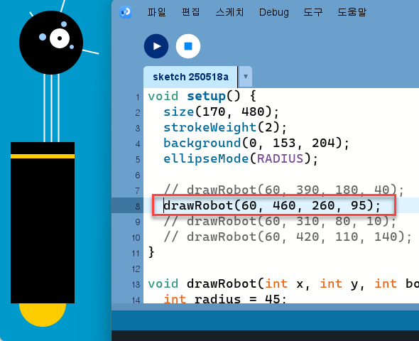

# Processing 코드 함수화

## 원본 코드

시작하기 전, 원본 코드를 분석해 보고 해결해야 할 문제를 확인해 보겠다.

```java
int x = 60; // X-coordinate
int y = 390; // Y-coordinate
int bodyHeight = 180; // Body Height
int neckHeight = 40; // Neck Height
int radius = 45;
int ny = y - bodyHeight - neckHeight - radius; // Neck Y

size(170, 480);
strokeWeight(2);
background(0, 153, 204);
ellipseMode(RADIUS);

// Neck
stroke(255);
line(x+2, y-bodyHeight, x+2, ny);
line(x+12, y-bodyHeight, x+12, ny);
line(x+22, y-bodyHeight, x+22, ny);

// Antennae
line(x+12, ny, x-18, ny-43);
line(x+12, ny, x+42, ny-99);
line(x+12, ny, x+78, ny+15);

// Body
noStroke();
fill(255, 204, 0);
ellipse(x, y-33, 33, 33);
fill(0);
rect(x-45, y-bodyHeight, 90, bodyHeight-33);
fill(255, 204, 0);
rect(x-45, y-bodyHeight+17, 90, 6);

// Head
fill(0);
ellipse(x+12, ny, radius, radius);
fill(255);
ellipse(x+24, ny-6, 14, 14);
fill(0);
ellipse(x+24, ny-6, 3, 3);
fill(153, 204, 255);
ellipse(x, ny-8, 5, 5);
ellipse(x+30, ny-26, 4, 4);
ellipse(x+41, ny+6, 3, 3);
```

### 원본 코드 실행 결과


### 코드 분석

```java
// 로봇의 위치 및 크기 관련 변수 설정
int x = 60;                  // 로봇의 X 좌표 (좌우 위치)
int y = 390;                 // 로봇 몸통 아래쪽의 Y 좌표 (전체 기준점)
int bodyHeight = 180;        // 몸통의 높이
int neckHeight = 40;         // 목의 길이
int radius = 45;             // 머리(원형)의 반지름

int ny = y - bodyHeight - neckHeight - radius;  // 머리 중심의 Y 좌표 계산 (몸통 + 목 + 머리 높이 합산하여 위쪽으로)

// 캔버스 설정
size(170, 480);                     // 캔버스 크기 설정 (너비 170, 높이 480)
strokeWeight(2);                   // 선 두께 설정
background(0, 153, 204);           // 배경색 (밝은 파란색)
ellipseMode(RADIUS);              // ellipse() 함수가 반지름 기준으로 동작하도록 설정

// === 목(Neck) 부분 ===
stroke(255);                       // 선 색상: 흰색
line(x+2, y-bodyHeight, x+2, ny);      // 왼쪽 목줄기
line(x+12, y-bodyHeight, x+12, ny);    // 가운데 목줄기
line(x+22, y-bodyHeight, x+22, ny);    // 오른쪽 목줄기

// === 더듬이(Antennae) 부분 ===
line(x+12, ny, x-18, ny-43);       // 왼쪽 위로 향하는 더듬이
line(x+12, ny, x+42, ny-99);       // 오른쪽 위로 향하는 더듬이
line(x+12, ny, x+78, ny+15);       // 오른쪽 아래로 향하는 더듬이

// === 몸통(Body) 부분 ===
noStroke();                        // 몸통 외곽선 제거
fill(255, 204, 0);                 // 노란색: 상단 타원형 장식
ellipse(x, y-33, 33, 33);          // 몸통 상단 타원형

fill(0);                           // 검정색: 몸통 사각형
rect(x-45, y-bodyHeight, 90, bodyHeight-33);  // 몸통 사각형

fill(255, 204, 0);                 // 노란색: 몸통에 있는 장식줄
rect(x-45, y-bodyHeight+17, 90, 6);           // 몸통 장식줄

// === 머리(Head) 부분 ===
fill(0);                           // 검정색: 머리 전체
ellipse(x+12, ny, radius, radius);            // 머리 (원형)

fill(255);                         // 흰색: 눈
ellipse(x+24, ny-6, 14, 14);                  // 오른쪽 눈

fill(0);                           // 검정색: 눈동자
ellipse(x+24, ny-6, 3, 3);                    // 눈동자

fill(153, 204, 255);               // 연한 파란색: 머리 주변 장식 점
ellipse(x, ny-8, 5, 5);                       // 장식 점 1
ellipse(x+30, ny-26, 4, 4);                   // 장식 점 2
ellipse(x+41, ny+6, 3, 3);                    // 장식 점 3
```

### 문제 기술

위와 같이 원본 코드와 코드이 실행 결과 그리고 주석을 통해 각 코드의 기능과 의미를 분석해 보았다. 

하지만, 이 코드는 4장 연습문제에서 요구하는 것처럼 로봇의 네 가지 모양을 지니지 못한다. 

로봇의 y값과 몸통 길이 그리고 목 길이 즉 세 가지 변수의 값을 조절하여 만들 수 있는 로봇의 네 가지 모습을 구현하는 것이 이번 4장 연습문제의 핵심이다. 

여기서 해결해야 할 과제는 함수를 활용하여 로봇의 네 가지 모양을 구현하는 것이다. 

로봇의 각기 다른 네 가지 모습을 만들기 위해서는 앞서 말했듯 y값과 몸통 길이, 목 길이를 수정해야 한다. 

원본 코드의 문제는 바로 여기 있다. 각각의 값이 선언된 변수로 존재하기 때문이다. 

즉, y값이 390으로 할당되었으면 y값은 영원히 390이다. 이렇게 되면 각각의 모양에 해당하는 y값을 담당하는 변수를 하나씩 선언해야 한다. 

굉장히 비효율적이고 변수가 많아지므로 복잡해지고 가독성이 떨어진다. 좋지 못한 코드가 될 수 있다. 

그렇다면, 변수 선언을 최소화한 상태로 코드를 작성하는 것이 좋을 것이다. 


변수의 선언은 줄이되, 어떻게 하면 각각의 모양을 구성하는 변수의 값을 받아낼 수 있을까? 

이 때가 바로 함수를 사용할 때다. 

함수와 함수의 매개 변수 개념을 활용하여 로봇의 모양을 결정하는 변수를 매개 변수 값을 받는 함수로 구현하여 로봇을 만들어 낼 것이다. 


## 네 가지 모양의 로봇

본격적으로 함수를 활용하여 로봇을 만들기 전에 네 가지 모양의 로봇 코드를 직접 y값과 

몸통 길이, 목 길이 변수를 수정하여 작성해보고 출력 결과를 확인해 보겠다. 

변수의 값이 변화함에 따라 로봇의 모양이 어떻게 변화하고 4장의 연습문제와 같은 형태로 제대로 

출력되는지 확인해보는 작업이다.


변수; y, bodyHeight, neckHeight 이렇게 세 가지의 값을 

4장에서 요구하는 대로 수정하여 네 가지의 모양을 형성해 보겠다.

### 첫 번째 모양

```java
int x = 60; 
int y = 390; 
int bodyHeight = 180; 
int neckHeight = 40; 
int radius = 45;
int ny = y - bodyHeight - neckHeight - radius; 

size(170, 480);
strokeWeight(2);
background(0, 153, 204);
ellipseMode(RADIUS);

// Neck
stroke(255);
line(x+2, y-bodyHeight, x+2, ny);
line(x+12, y-bodyHeight, x+12, ny);
line(x+22, y-bodyHeight, x+22, ny);

// Antennae
line(x+12, ny, x-18, ny-43);
line(x+12, ny, x+42, ny-99);
line(x+12, ny, x+78, ny+15);

// Body
noStroke();
fill(255, 204, 0);
ellipse(x, y-33, 33, 33);
fill(0);
rect(x-45, y-bodyHeight, 90, bodyHeight-33);
fill(255, 204, 0);
rect(x-45, y-bodyHeight+17, 90, 6);

// Head
fill(0);
ellipse(x+12, ny, radius, radius);
fill(255);
ellipse(x+24, ny-6, 14, 14);
fill(0);
ellipse(x+24, ny-6, 3, 3);
fill(153, 204, 255);
ellipse(x, ny-8, 5, 5);
ellipse(x+30, ny-26, 4, 4);
ellipse(x+41, ny+6, 3, 3);
```

#### 변경 내용

```java
y = 390
bodyHeight = 180
neckHeight = 40
```


### 두 번째 모양

```java
int x = 60; 
int y = 460; 
int bodyHeight = 260; 
int neckHeight = 95; 
int radius = 45;
int ny = y - bodyHeight - neckHeight - radius; 

size(170, 480);
strokeWeight(2);
background(0, 153, 204);
ellipseMode(RADIUS);

// Neck
stroke(255);
line(x+2, y-bodyHeight, x+2, ny);
line(x+12, y-bodyHeight, x+12, ny);
line(x+22, y-bodyHeight, x+22, ny);

// Antennae
line(x+12, ny, x-18, ny-43);
line(x+12, ny, x+42, ny-99);
line(x+12, ny, x+78, ny+15);

// Body
noStroke();
fill(255, 204, 0);
ellipse(x, y-33, 33, 33);
fill(0);
rect(x-45, y-bodyHeight, 90, bodyHeight-33);
fill(255, 204, 0);
rect(x-45, y-bodyHeight+17, 90, 6);

// Head
fill(0);
ellipse(x+12, ny, radius, radius);
fill(255);
ellipse(x+24, ny-6, 14, 14);
fill(0);
ellipse(x+24, ny-6, 3, 3);
fill(153, 204, 255);
ellipse(x, ny-8, 5, 5);
ellipse(x+30, ny-26, 4, 4);
ellipse(x+41, ny+6, 3, 3);
```

#### 변경 내용

```java
y = 460
bodyHeight = 260
neckHeight = 95
```


### 세 번째 모양
```java
int x = 60; 
int y = 310; 
int bodyHeight = 80; 
int neckHeight = 10; 
int radius = 45;
int ny = y - bodyHeight - neckHeight - radius; 

size(170, 480);
strokeWeight(2);
background(0, 153, 204);
ellipseMode(RADIUS);

// Neck
stroke(255);
line(x+2, y-bodyHeight, x+2, ny);
line(x+12, y-bodyHeight, x+12, ny);
line(x+22, y-bodyHeight, x+22, ny);

// Antennae
line(x+12, ny, x-18, ny-43);
line(x+12, ny, x+42, ny-99);
line(x+12, ny, x+78, ny+15);

// Body
noStroke();
fill(255, 204, 0);
ellipse(x, y-33, 33, 33);
fill(0);
rect(x-45, y-bodyHeight, 90, bodyHeight-33);
fill(255, 204, 0);
rect(x-45, y-bodyHeight+17, 90, 6);

// Head
fill(0);
ellipse(x+12, ny, radius, radius);
fill(255);
ellipse(x+24, ny-6, 14, 14);
fill(0);
ellipse(x+24, ny-6, 3, 3);
fill(153, 204, 255);
ellipse(x, ny-8, 5, 5);
ellipse(x+30, ny-26, 4, 4);
ellipse(x+41, ny+6, 3, 3);
```

#### 변경 내용

```java
y = 310
bodyHeight = 80
neckHeight = 10
```


### 네 번째 모양

```java
int x = 60; 
int y = 420; 
int bodyHeight = 110; 
int neckHeight = 140; 
int radius = 45;
int ny = y - bodyHeight - neckHeight - radius; 

size(170, 480);
strokeWeight(2);
background(0, 153, 204);
ellipseMode(RADIUS);

// Neck
stroke(255);
line(x+2, y-bodyHeight, x+2, ny);
line(x+12, y-bodyHeight, x+12, ny);
line(x+22, y-bodyHeight, x+22, ny);

// Antennae
line(x+12, ny, x-18, ny-43);
line(x+12, ny, x+42, ny-99);
line(x+12, ny, x+78, ny+15);

// Body
noStroke();
fill(255, 204, 0);
ellipse(x, y-33, 33, 33);
fill(0);
rect(x-45, y-bodyHeight, 90, bodyHeight-33);
fill(255, 204, 0);
rect(x-45, y-bodyHeight+17, 90, 6);

// Head
fill(0);
ellipse(x+12, ny, radius, radius);
fill(255);
ellipse(x+24, ny-6, 14, 14);
fill(0);
ellipse(x+24, ny-6, 3, 3);
fill(153, 204, 255);
ellipse(x, ny-8, 5, 5);
ellipse(x+30, ny-26, 4, 4);
ellipse(x+41, ny+6, 3, 3);
```

#### 변경 내용

```java
y = 420
bodyHeight = 110
neckHeight = 140
```


## 여러 모양의 로봇을 함수로 관리하기

자, 앞서 원본 코드에서 문제 의식을 잡아 냈고 

변수(로봇의 Y 좌표 값, 로봇의 몸통 길이, 로봇의 목 길이)를 수정하여 

변수의 값 변화에 따른 형태 변화 양상을 분석한 뒤, 

만들 수 있는 네 가지의 로봇 형태를 직접 실행하여 확인해 보았다. 

문제 없이 정상 출력되는 것을 확인했으니, 

문제 기술 단계에서 찾아낸 해결 방법이자 이번 과제의 핵심 주제인 함수를 이용하여 로봇을 구현해 보겠다.

```java
void setup() {
  size(170, 480);
  strokeWeight(2);
  background(0, 153, 204);
  ellipseMode(RADIUS);

  drawRobot(60, 390, 180, 40);
  // drawRobot(60, 460, 260, 95);
  // drawRobot(60, 310, 80, 10);
  // drawRobot(60, 420, 110, 140);
}

void drawRobot(int x, int y, int bodyHeight, int neckHeight) {
  int radius = 45;
  int ny = y - bodyHeight - neckHeight - radius;

  stroke(255);
  line(x+2, y-bodyHeight, x+2, ny);
  line(x+12, y-bodyHeight, x+12, ny);
  line(x+22, y-bodyHeight, x+22, ny);

  line(x+12, ny, x-18, ny-43);
  line(x+12, ny, x+42, ny-99);
  line(x+12, ny, x+78, ny+15);

  noStroke();
  fill(255, 204, 0);
  ellipse(x, y-33, 33, 33);
  fill(0);
  rect(x-45, y-bodyHeight, 90, bodyHeight-33);
  fill(255, 204, 0);
  rect(x-45, y-bodyHeight+17, 90, 6);

  fill(0);
  ellipse(x+12, ny, radius, radius);
  fill(255);
  ellipse(x+24, ny-6, 14, 14);
  fill(0);
  ellipse(x+24, ny-6, 3, 3);
  fill(153, 204, 255);
  ellipse(x, ny-8, 5, 5);
  ellipse(x+30, ny-26, 4, 4);
  ellipse(x+41, ny+6, 3, 3);
}
```

함수 drawRobot()을 정의했다. 

원본 코드 상에 선언되어 있던 변수들을 모두 매개 변수로 받을 수 있게 수정한 뒤,

4개의 각각 매개 변수가 다른 함수를 선언하여 캔버스 상에 4개의 로봇 모양을 구현할 수 있도록
 
만들었다. 캔버스 크기가 170x480으로 제한되어 있기에 그리고 싶은 로봇 모양을 지닌 함수를
  
제외하고 주석 처리하였다. 만약 하나의 캔버스에 네 개의 로봇을 모두 표현하고 싶다면 
  
setup()에서 size()함수를 통해 캔버스 크기를 적당히 조절한 후 매개 변수 x값을 통해 
  
로봇의 x 좌표 위치를 지정하여 로봇 간 거리를 확보하여 하나의 캔버스에 네 가지 모양의 로봇을 
  
모두 표현할 수도 있다. 이 일련의 과정을 간략히 설명하자면, 중복된 부분을 함수로 추출해냈다고 
  
볼 수 있다. 즉, 정해진 변수를 함수를 통해 매개 변수로 받도록 하여 유동적으로 
  
값을 변경할 수 있는 유연한 코드로 변경하였다.

이미 만들어진 코드를 함수를 통해 수정하는 과정을 경험하면서

이리저리 실습을 해보며 Processing 언어의 함수 선언 규칙과 setup()함수의 역할과 위치의 중요성

그리고 Processing에서 내가 만든 함수의 원형과 정의는 어디에 위치해야 하며 setup()함수와 

무슨 관계가 발생할 수 있는지 알게 되었다.

이번 과제를 해결하고자 4장 로봇 연습문제의 코드를 직접 수정해보고 타이핑 해보며 최종적으로
  
문제 기술 부분에서 발생했던 코드의 문제를 해결하고 
  
네 가지 모양의 로봇을 구현하는 데에 성공했다. 
  
또한 과제의 핵심 키워드인 함수도 확실히 이용하여 해결했다. 

아래는 각 함수별 실행 시 결과 출력물을 캡처한 것이다. 

### 첫 번째 모양


### 두 번째 모양



### 세 번째 모양


### 네 번째 모양


## 마우스 이벤트를 통한 로봇 모양 구성

이제 만들어 놓은 코드에 마우스 이벤트에 따른 기능을 추가할 것이다.

캔버스의 크기를 키우고 캔버스를 x축을 기준으로 4등분하고 

마우스의 위치에 따라 해당 위치에 각 모양의 로봇이 등장하도록 할 것이다. 

왼쪽에서부터 각각 로봇의 첫 번째 모양이다.

```java
void setup() {
  size(680, 480);  // 170 x 4
  strokeWeight(2);
  ellipseMode(RADIUS);
}

void draw() {
  background(0, 153, 204);

  if (mouseX < width / 4) {
    // 첫 번째 영역 → 첫 번째 모양
    drawRobot(85, 390, 180, 40);
  } else if (mouseX < width / 2) {
    // 두 번째 영역 → 두 번째 모양
    drawRobot(85 + 170, 460, 260, 95);
  } else if (mouseX < width * 3 / 4) {
    // 세 번째 영역 → 세 번째 모양
    drawRobot(85 + 340, 310, 80, 10);
  } else {
    // 네 번째 영역 → 네 번째 모양
    drawRobot(85 + 510, 420, 110, 140);
  }
}

void drawRobot(int x, int y, int bodyHeight, int neckHeight) {
  int radius = 45;
  int ny = y - bodyHeight - neckHeight - radius;

  // Neck
  stroke(255);
  line(x+2, y-bodyHeight, x+2, ny);
  line(x+12, y-bodyHeight, x+12, ny);
  line(x+22, y-bodyHeight, x+22, ny);

  // Antennae
  line(x+12, ny, x-18, ny-43);
  line(x+12, ny, x+42, ny-99);
  line(x+12, ny, x+78, ny+15);

  // Body
  noStroke();
  fill(255, 204, 0);
  ellipse(x, y-33, 33, 33);
  fill(0);
  rect(x-45, y-bodyHeight, 90, bodyHeight-33);
  fill(255, 204, 0);
  rect(x-45, y-bodyHeight+17, 90, 6);

  // Head
  fill(0);
  ellipse(x+12, ny, radius, radius);
  fill(255);
  ellipse(x+24, ny-6, 14, 14);
  fill(0);
  ellipse(x+24, ny-6, 3, 3);
  fill(153, 204, 255);
  ellipse(x, ny-8, 5, 5);
  ellipse(x+30, ny-26, 4, 4);
  ellipse(x+41, ny+6, 3, 3);
}
```

어떻게 하면 더욱 훌륭하게 캔버스를 4등분할 수 있을까 고민하다가 

Processing 내부에 내장된 전역 변수 width를 이용하기로 했다. 

width는 현재 설정된 캔버스의 너비를 의미하는 변수다.

### 출력 결과


다음은 마우스 위치에 따른 로봇 모양의 출력 결과다.

정상적으로 작동되는 것을 확인하였고 네 가지의 모양이 깨지지 않고 출력된다.

캔버스를 기존 대비 x축으로 4배 확장 후 width 내장 전역 변수를 통해

정확히 4등분한 뒤, 마우스의 위치 이벤트를 통해 위치에 따라 네 가지 모양의 로봇을
모두 

구현하였다. 위치에 따라 한 가지 모양의 로봇만 등장하도록 background()를

이용하였고 기존에 만들어 둔 함수의 매개 변수 x 자리에 값을 넣어 

원하는 위치에 로봇이 등장할 수 있게도 하였다.

모든 것이 원하는 대로 작동하는 것을 확인하였다.


