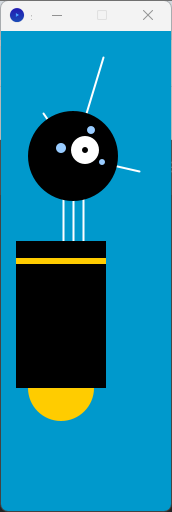

# Processing 코드 함수화

## 원본 코드

```java
int x = 60; // X-coordinate
int y = 390; // Y-coordinate
int bodyHeight = 180; // Body Height
int neckHeight = 40; // Neck Height
int radius = 45;
int ny = y - bodyHeight - neckHeight - radius; // Neck Y

size(170, 480);
strokeWeight(2);
background(0, 153, 204);
ellipseMode(RADIUS);

// Neck
stroke(255);
line(x+2, y-bodyHeight, x+2, ny);
line(x+12, y-bodyHeight, x+12, ny);
line(x+22, y-bodyHeight, x+22, ny);

// Antennae
line(x+12, ny, x-18, ny-43);
line(x+12, ny, x+42, ny-99);
line(x+12, ny, x+78, ny+15);

// Body
noStroke();
fill(255, 204, 0);
ellipse(x, y-33, 33, 33);
fill(0);
rect(x-45, y-bodyHeight, 90, bodyHeight-33);
fill(255, 204, 0);
rect(x-45, y-bodyHeight+17, 90, 6);

// Head
fill(0);
ellipse(x+12, ny, radius, radius);
fill(255);
ellipse(x+24, ny-6, 14, 14);
fill(0);
ellipse(x+24, ny-6, 3, 3);
fill(153, 204, 255);
ellipse(x, ny-8, 5, 5);
ellipse(x+30, ny-26, 4, 4);
ellipse(x+41, ny+6, 3, 3);
```

### 원본 코드 실행 결과


### 코드 분석

```java
// 로봇의 위치 및 크기 관련 변수 설정
int x = 60;                  // 로봇의 X 좌표 (좌우 위치)
int y = 390;                 // 로봇 몸통 아래쪽의 Y 좌표 (전체 기준점)
int bodyHeight = 180;        // 몸통의 높이
int neckHeight = 40;         // 목의 길이
int radius = 45;             // 머리(원형)의 반지름

int ny = y - bodyHeight - neckHeight - radius;  // 머리 중심의 Y 좌표 계산 (몸통 + 목 + 머리 높이 합산하여 위쪽으로)

// 캔버스 설정
size(170, 480);                     // 캔버스 크기 설정 (너비 170, 높이 480)
strokeWeight(2);                   // 선 두께 설정
background(0, 153, 204);           // 배경색 (밝은 파란색)
ellipseMode(RADIUS);              // ellipse() 함수가 반지름 기준으로 동작하도록 설정

// === 목(Neck) 부분 ===
stroke(255);                       // 선 색상: 흰색
line(x+2, y-bodyHeight, x+2, ny);      // 왼쪽 목줄기
line(x+12, y-bodyHeight, x+12, ny);    // 가운데 목줄기
line(x+22, y-bodyHeight, x+22, ny);    // 오른쪽 목줄기

// === 더듬이(Antennae) 부분 ===
line(x+12, ny, x-18, ny-43);       // 왼쪽 위로 향하는 더듬이
line(x+12, ny, x+42, ny-99);       // 오른쪽 위로 향하는 더듬이
line(x+12, ny, x+78, ny+15);       // 오른쪽 아래로 향하는 더듬이

// === 몸통(Body) 부분 ===
noStroke();                        // 몸통 외곽선 제거
fill(255, 204, 0);                 // 노란색: 상단 타원형 장식
ellipse(x, y-33, 33, 33);          // 몸통 상단 타원형

fill(0);                           // 검정색: 몸통 사각형
rect(x-45, y-bodyHeight, 90, bodyHeight-33);  // 몸통 사각형

fill(255, 204, 0);                 // 노란색: 몸통에 있는 장식줄
rect(x-45, y-bodyHeight+17, 90, 6);           // 몸통 장식줄

// === 머리(Head) 부분 ===
fill(0);                           // 검정색: 머리 전체
ellipse(x+12, ny, radius, radius);            // 머리 (원형)

fill(255);                         // 흰색: 눈
ellipse(x+24, ny-6, 14, 14);                  // 오른쪽 눈

fill(0);                           // 검정색: 눈동자
ellipse(x+24, ny-6, 3, 3);                    // 눈동자

fill(153, 204, 255);               // 연한 파란색: 머리 주변 장식 점
ellipse(x, ny-8, 5, 5);                       // 장식 점 1
ellipse(x+30, ny-26, 4, 4);                   // 장식 점 2
ellipse(x+41, ny+6, 3, 3);                    // 장식 점 3
```

